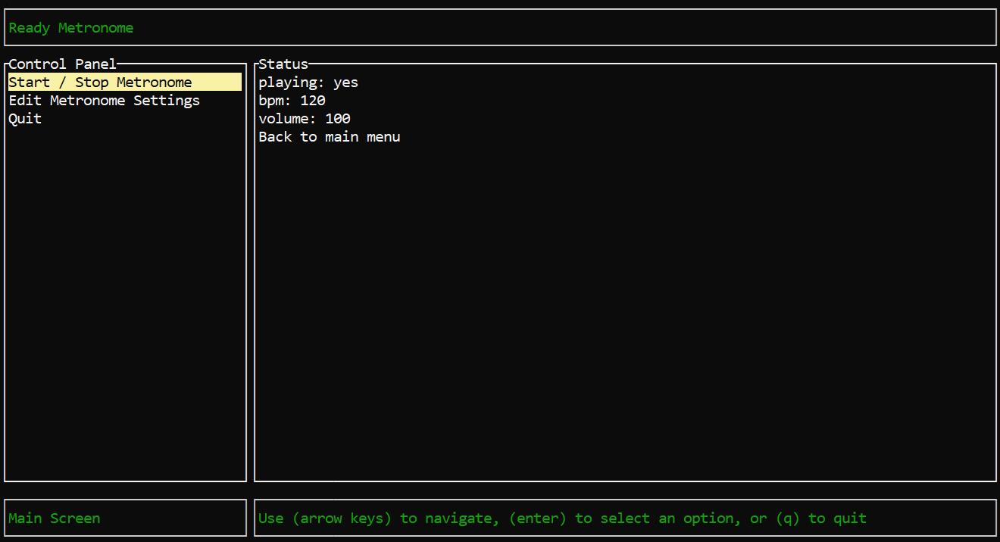
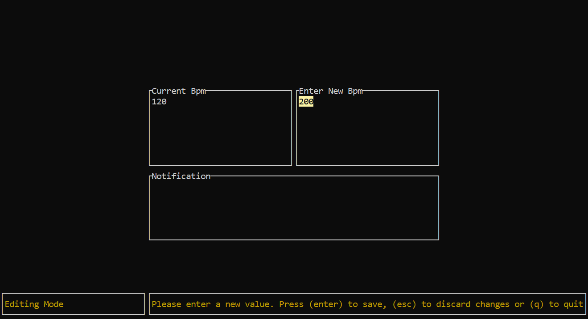

# Ready Metronome

## Peter Wells, CS-510: Rust Programming Final Project, Fall 2023

A simple, quick to launch metronome application written in Rust by Peter Wells for CS-510: Rust Programming in Fall 2023 at Portland State University.

It is built with Rodio to control the audio, Spin Sleep to ensure accurate timing and Ratatui to give it a nice Terminal UI.

## Description

Ready Metronome is a lightweight terminal based metronome application. It is designed to load quickly and get a metronome ticking fast.

### Why make this?

Background: I am both a programmer and a drummer. As such, I find myself wanting to use a flexible, lightweight metronome application while I am at the computer with a few moments to spare. Having this will allow any musician to quickly start practicing without having to open a resource intensive audio application (typically a DAW like Ableton) in order to have a metronome. I want to provide this so that there is one less barrier for musicians at the keyboard to start practicing.

Note: Yes I know google has a metronome, I find it is not very flexible and I aim to make a better one.

---

### Build Instructions

#### Note: Due to some limitations with Cargo Build, these instructions are a little more involved than you might expect. I plan on making this easier in the future with actual installers

1. Clone this repository with `git clone https://github.com/unfinishedideas/ReadyMetronome.git`
2. Navigate to the project root directory (`cd ReadyMetronome`) and run `cargo build -r` to make a release build
3. **This is the weird step!** Due to cargo refusing to copy over the `EmeryBoardClick.wav` file, you must run the application from the project root directory in a terminal window. Once there, run it with `./target/release/readymetronome.exe`. (or `\`'s if you are on windows) If you see an error when starting the, metronome with `t` then quit the program and ensure you are in the correct directory. Alternatively, you can copy the `./assets` folder to `/target/release` and run it normally.

#### Alternatively, You can run this program in debug mode by cloning the repo down and simply running it with `cargo run`

---

### Usage Instructions

First, run the generated file you created in the above steps in a terminal.

#### Controls

Often there is help text in the bottom right quardrant of the user interface to guide you. But here are some basic commands to get you started.

- Use the arrow keys or tab / shift-tab to navigate menus
- Press 'enter' to make a selection
- Press 'esc' to back out of a menu
- Press 'q' to quit at any time
- Press 't' when not editing a value to toggle the metronome on and off

#### Edit Mode

When changing one of the metronome settings a pop up editor window will open. Simply enter the new value you wish to use and press enter. If you enter an invalid value, the notification area will inform you.

#### Valid values

- Between 20-500 bpm
- Between 1.0 - 200.0 for volume (measured in %)

## Project Reflection

### Testing

Admittedly, testing was not my primary focus when building this as learning how to set up Ratatui took a good portion of my brainpower. I primarily tested through trial and error while using the application and cleaning up any edge cases with the code. I have gone back and added an error flag to app.rs to give the main event loop a way to gracefully exit without blowing up as well as some tests to check that functions behave as expected.

### What worked

I found that making this app was quite fun. While it took a long time to understand how it is set up, setting up [Ratatui](https://github.com/ratatui-org/ratatui) helped to really bring this app alive. Following their [JSON Editor](https://ratatui.rs/tutorials/json-editor/) helped to solidify the ideas. With the actual multi-threaded audio processing I found that using the [Rodio](https://docs.rs/rodio/latest/rodio/) library and [Arc(Atomic)'s](https://doc.rust-lang.org/std/sync/atomic/) greatly simplified the process and was up and running relatively quickly in the process which emboldened me to try to set up the tui.

### What didn't

Due to the complexity of the code I didn't really get around to writing good thorough testing. Rather, I simply tried to break the program in as many ways as possible as I worked on it and patched holes. This is largely due to the fact that it took me a long time to undertand just how these pieces of Ratatui are put together. Additionally, the line count on a lot of these files really ballooned to extreme preportions. I am sure there are plenty of ways to simplify the code; `event.rs` and `ui.rs` especially feel rather bloated. I chuck this up to not understanding Ratatui enough yet to break it down into more readible chunks; but also UI code tends to multiply in size as complexity increases.

### How satisfied are you with the result?

Overall, I am very satisfied with the result! I accomplished what I set out to accomplish, a simple to use and fast to launch metronome application. Though there is still more to be done.

### What would you like to improve in the future?

I would lke to improve test coverage and split out the functionality of some of these files (especially `event.rs` and `ui.rs`) so that it is easier to read. I found myself slowing down while working on it because there was so much code to parse, especially in the ui. I also really want to add some of the planned features below with Portable Installers as a priority to fix up the problem with `cargo build -r` being unable to copy my audio file. I eventually want to add loading of custom click sound files as well since my simple little `EmeryBoardClick.wav` is not very exciting.

## Planned Features

- Portable installers
- TUI-less operation
- Support for custom sounds
- Allow accents and custom time signatures
- Select beats to silence
- Scrolling help text, currently it can cut off on some terminal sizes

## Technologies Used and References

- [Ratatui](https://github.com/ratatui-org/ratatui)
- [Ratatui JSON Editor tutorial](https://ratatui.rs/tutorials/json-editor/)
- [Rodio](https://docs.rs/rodio/latest/rodio/)
- [Cross-Platform Audio Library (cpal) (implemented by Rodio)](https://github.com/RustAudio/cpal)
- [Spin Sleep](https://crates.io/crates/spin_sleep)  

## License

This project is licensed under the [MIT License](/LICENSE)
